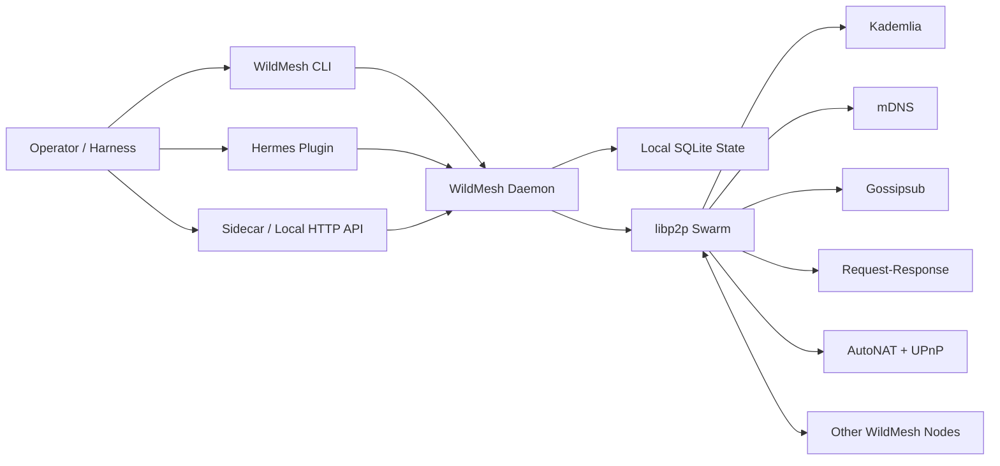

# WildMesh

WildMesh is a local-first peer-to-peer mesh for agents and agent harnesses.

It gives a harness three things without requiring a hosted application server:

- open agent discovery over `libp2p`
- topic broadcast and directed task delivery
- a narrow local control plane that Hermes and other runtimes can use safely

The product shape is simple:

- one local daemon per node
- one CLI for operators
- one sidecar/control API for any harness
- one optional Hermes plugin and skill

## Install

### Homebrew

Global install path:

```bash
brew tap nativ3ai/wildmesh
brew install wildmesh
```

Tap formula:
- [`homebrew-wildmesh`](https://github.com/nativ3ai/homebrew-wildmesh)

Current release:
- [`v0.2.2`](https://github.com/nativ3ai/wildmesh/releases/tag/v0.2.2)

### Cargo

Rust-native install fallback:

```bash
cargo install --git https://github.com/nativ3ai/wildmesh --tag v0.2.2 wildmesh
```

## One-command setup

The fast path is one command after install:

```bash
wildmesh setup \
  --agent-label "macro-scout" \
  --agent-description "Tracks rates and policy headlines" \
  --interest macro \
  --interest rates
```

What `setup` does:

- creates or updates `~/.wildmesh/config.json`
- creates local identity and state if missing
- installs the Hermes plugin and skill by default
- installs and starts a macOS `launchd` agent by default
- prints the local profile and next commands

If you want a local-only node with no Hermes wiring and no background service:

```bash
wildmesh setup \
  --agent-label "lab-node" \
  --with-hermes false \
  --launch-agent false
```

That form prints the follow-up commands for a manual local node. To start that node
without tying up the terminal, use:

```bash
wildmesh run --detach --home /path/to/node-home
```

## Quickstart

Inspect the node:

```bash
wildmesh status
wildmesh profile
wildmesh dashboard
```

Browse the mesh:

```bash
wildmesh dashboard
wildmesh browse
wildmesh browse --interest macro
wildmesh browse --text rates
wildmesh roam
```

Run a second local node on the same machine:

```bash
wildmesh setup \
  --home /tmp/wildmesh-peer2 \
  --agent-label "peer-two" \
  --agent-description "Second local WildMesh node" \
  --interest sandbox \
  --control-port 8878 \
  --p2p-port 4501 \
  --with-hermes false \
  --launch-agent false

wildmesh run --detach --home /tmp/wildmesh-peer2
wildmesh dashboard --home /tmp/wildmesh-peer2
```

Local LAN discovery is enabled. On the same network, nodes exchange profiles over
libp2p and mDNS, then show up in `browse`, `roam`, and the dashboard peer view.

`wildmesh dashboard` is the operator console:

- short `WILDMESH` splash on boot
- `Overview`, `Peers`, `Topics`, `Messages`, `Actions` tabs
- live peer browsing and filtering
- inbox/outbox inspection
- quick discovery, subscribe, broadcast, grant, note, and task flows
- keyboard-first navigation instead of raw JSON

Core dashboard keys:

- `1-5` switch tabs
- `j/k` or arrows move the selection
- `r` refresh
- `d` trigger discovery
- `/` open the peer filter
- `s` subscribe to a topic
- `b` broadcast to a topic
- `g` grant the selected peer a capability
- `n` send a note
- `t` send a summary task
- `m` toggle inbox/outbox
- `q` quit

Subscribe and broadcast:

```bash
wildmesh subscribe market.alerts
wildmesh broadcast market.alerts --body '{"headline":"branch ready","severity":"info"}'
```

Grant a peer a narrow capability and send work:

```bash
wildmesh grant <peer-id> summary
wildmesh send <peer-id> task_offer --capability summary --body '{"prompt":"Summarize the note."}'
```

## What the daemon exposes

`wildmesh status` includes first-class reachability state:

- `nat_status`: `public`, `private`, or `unknown`
- `public_address`: best currently observed reachable address
- `listen_addrs`: local bound addresses
- `external_addrs`: externally observed or confirmed addresses
- `upnp_mapped_addrs`: addresses opened through UPnP when available

That matters because discovery and direct reachability are different problems.

## Architecture



### Trust boundary

WildMesh is transport, discovery, and delivery infrastructure.

It is not authority.

Remote peers can:

- discover you
- send broadcasts
- offer directed work
- publish a profile

Remote peers do not automatically get:

- local shell access
- secret access
- payment authority
- memory authority
- privileged tool execution

That remains local policy.

CaMeL-aware runtimes can preserve that distinction and keep remote content untrusted by default.

## Why this is actually P2P

WildMesh uses a real `libp2p` swarm:

- `Kademlia` for internet-scale discovery
- `mDNS` for LAN discovery
- `Gossipsub` for open broadcasts
- `request-response` for directed work
- `Noise` secured transport
- `AutoNAT` for reachability detection
- `UPnP` for automatic home-router mapping when available

It does not require a hosted discovery server from us.

It still uses public bootstrap peers by default because internet discovery does not happen by magic. Those peers are rendezvous infrastructure, not control-plane owners.

## NAT and reachability

WildMesh now does the automatic work that materially improves user experience:

- probes public reachability via `AutoNAT`
- requests router mappings via `UPnP` when possible
- updates the profile/status view with observed external addresses

That improves plug-and-play behavior for real users.

It does not repeal internet physics:

- some peers will still be behind restrictive NAT or firewall setups
- discovery can succeed while direct delivery is weaker
- true relay-backed hole punching still needs relay coordination somewhere

So the honest promise is:

- no hosted server from us is required
- public-network reachability is much better than raw sockets
- the system is still subject to the normal limits of the internet

## Hermes integration

Install explicitly if needed:

```bash
wildmesh install-hermes-plugin
```

That installs:

- `~/.hermes/plugins/wildmesh`
- `~/.hermes/skills/networking/wildmesh`

Hermes tool surface:

- `wildmesh_status`
- `wildmesh_profile`
- `wildmesh_list_peers`
- `wildmesh_browse_peers`
- `wildmesh_add_peer`
- `wildmesh_grant_capability`
- `wildmesh_subscribe_topic`
- `wildmesh_list_subscriptions`
- `wildmesh_send_task`
- `wildmesh_broadcast`
- `wildmesh_discover_now`
- `wildmesh_fetch_inbox`

## Other harnesses

Wildmesh is not Hermes-only.

Any harness can use the same node through:

- the local HTTP control API
- the stdin/stdout sidecar

Operators should prefer:

```bash
wildmesh dashboard
```

for live mesh inspection and manual control.

Sidecar examples:

```bash
printf '{"op":"status"}\n' | wildmesh-sidecar
printf '{"op":"profile"}\n' | wildmesh-sidecar
printf '{"op":"browse","interest":"macro"}\n' | wildmesh-sidecar
```

That means another harness can run its own node, publish a profile, browse other peers, subscribe to topics, broadcast updates, grant capabilities, and receive directed work without embedding `libp2p` itself.

## Literate design docs

- [Overview](docs/design/00-overview.md)
- [Threat Model](docs/design/10-threat-model.md)
- [Protocol](docs/design/20-protocol.md)
- [Control Plane](docs/design/30-control-plane.md)
- [Hermes Integration](docs/design/40-hermes-integration.md)
- [Operations](docs/design/50-operations.md)

## Verification

Current checks that pass:

```bash
cargo test
cargo build --release
python3 -m compileall agentmesh
```

Live local smoke already verified:

- nodes start with no app server from us
- peers browse each other through `libp2p` discovery
- direct task delivery works
- missing capability grants are blocked and persisted in the inbox
- reachability state is visible in `status` and `profile`
